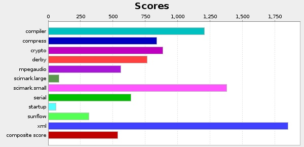
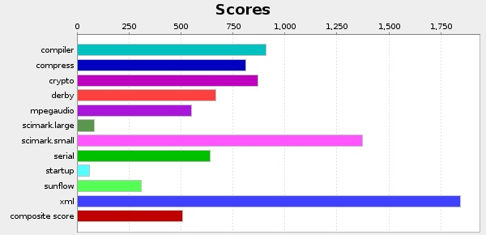
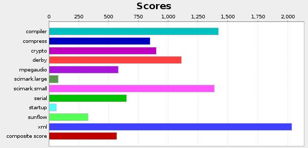
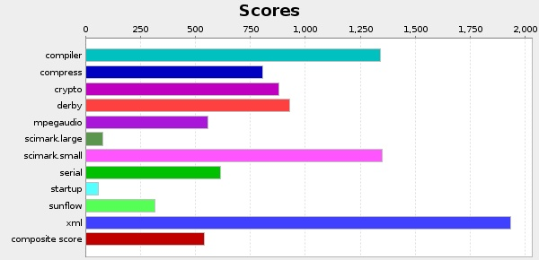
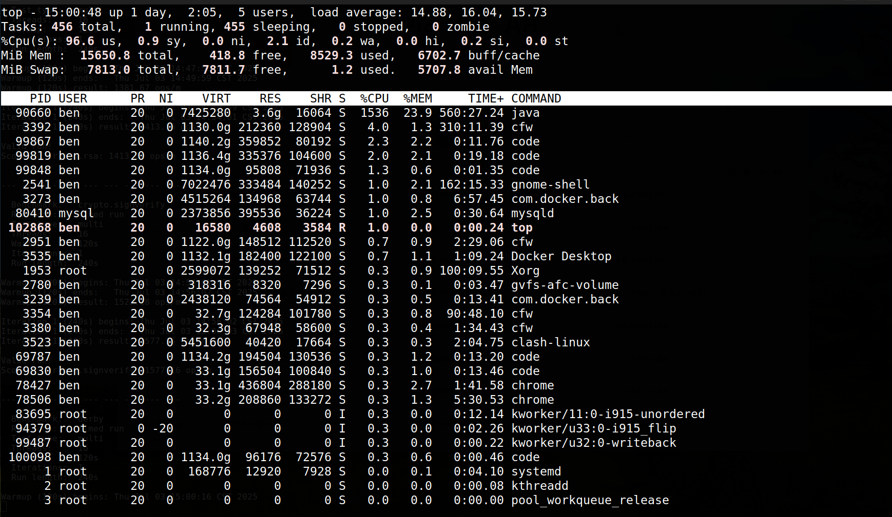

# Assignment 1: Software Performance Measurement

## 配置描述

---

:computer: **Hardware**

```log
Architecture:                         x86_64
CPU op-mode(s):                       32-bit, 64-bit
Address sizes:                        39 bits physical, 48 bits virtual
Byte Order:                           Little Endian
CPU(s):                               16
Vendor ID:                            GenuineIntel
Model name:                           11th Gen Intel(R) Core(TM) i7-11800H @ 2.30GHz
CPU family:                           6
Model:                                141
Thread(s) per core:                   2
Core(s) per socket:                   8
Socket(s):                            1
Stepping:                             1
CPU max MHz:                          4600.0000
CPU min MHz:                          800.0000
Virtualization:                       VT-x
L1d cache:                            384 KiB (8 instances)
L1i cache:                            256 KiB (8 instances)
L2 cache:                             10 MiB (8 instances)
L3 cache:                             24 MiB (1 instance)
NUMA node(s):                         1
NUMA node0 CPU(s):                    0-15
```

---

:penguin: **OS version**

```log
Distributor ID:	Ubuntu
Description:	Ubuntu 22.04.5 LTS
Release:	22.04
Codename:	jammy
```

---

:coffee: **JRE version**

```log
java version "1.7.0_80"
Java(TM) SE Runtime Environment (build 1.7.0_80-b15)
Java HotSpot(TM) 64-Bit Server VM (build 24.80-b11, mixed mode)
```

---

:bar_chart: **Output score**

本次测试一共运行**4**次SPECjvm2008，其中为**2**次为`base run`，**2**次为`peak run`，结果如下：

对于base run测试，两次均使用`SPECjvm2008`的默认参数，采用指令`java -jar SPECjvm2008`运行

<TABLE WIDTH=100% BORDER=1>
    <THEAD>
            <COL width = 20%>
            <COL width = 20%>
            <COL width = 55%>
    </THEAD>
    <TBODY>
        <TR>
            <TD><FONT SIZE=+1>Benchmark Base1 </FONT></TD>
            <TD><FONT SIZE=+1>ops/m</FONT></TD>
            <TD  ALIGN=CENTER ROWSPAN=13>  </IMG></TD>
        </TR>
        <TR>
            <TD ALIGN=LEFT>compiler</TD>
            <TD ALIGN=LEFT>1206.61</TD>
        </TR>
        <TR>
            <TD ALIGN=LEFT>compress</TD>
            <TD ALIGN=LEFT>839.28</TD>
        </TR>
        <TR>
            <TD ALIGN=LEFT>crypto</TD>
            <TD ALIGN=LEFT>884.24</TD>
        </TR>
        <TR>
            <TD ALIGN=LEFT>derby</TD>
            <TD ALIGN=LEFT>765.41</TD>
        </TR>
        <TR>
            <TD ALIGN=LEFT>mpegaudio</TD>
            <TD ALIGN=LEFT>561.14</TD>
        </TR>
        <TR>
            <TD ALIGN=LEFT>scimark.large</TD>
            <TD ALIGN=LEFT>84.96</TD>
        </TR>
        <TR>
            <TD ALIGN=LEFT>scimark.small</TD>
            <TD ALIGN=LEFT>1375.41</TD>
        </TR>
        <TR>
            <TD ALIGN=LEFT>serial</TD>
            <TD ALIGN=LEFT>639.17</TD>
        </TR>
        <TR>
            <TD ALIGN=LEFT>startup</TD>
            <TD ALIGN=LEFT>62.19</TD>
        </TR>
        <TR>
            <TD ALIGN=LEFT>sunflow</TD>
            <TD ALIGN=LEFT>313.06</TD>
        </TR>
        <TR>
            <TD ALIGN=LEFT>xml</TD>
            <TD ALIGN=LEFT>1849.41</TD>
        </TR>
        <TR>
            <TD  ALIGN=RIGHT COLSPAN=2> <FONT SIZE=+1>Composite result: 535.31 SPECjvm2008 Base ops/m</FONT></TD>
        </TR>
    </TBODY>
</TABLE>

<TABLE WIDTH=100% BORDER=1>
    <THEAD>
            <COL width = 20%>
            <COL width = 20%>
            <COL width = 55%>
    </THEAD>
    <TBODY>
        <TR>
            <TD><FONT SIZE=+1>Benchmark Base 2</FONT></TD>
            <TD><FONT SIZE=+1>ops/m</FONT></TD>
            <TD  ALIGN=CENTER ROWSPAN=13>  </IMG></TD>
        </TR>
        <TR>
            <TD ALIGN=LEFT>compiler</TD>
            <TD ALIGN=LEFT>908.83</TD>
        </TR>
        <TR>
            <TD ALIGN=LEFT>compress</TD>
            <TD ALIGN=LEFT>812.24</TD>
        </TR>
        <TR>
            <TD ALIGN=LEFT>crypto</TD>
            <TD ALIGN=LEFT>872.47</TD>
        </TR>
        <TR>
            <TD ALIGN=LEFT>derby</TD>
            <TD ALIGN=LEFT>669.82</TD>
        </TR>
        <TR>
            <TD ALIGN=LEFT>mpegaudio</TD>
            <TD ALIGN=LEFT>549.39</TD>
        </TR>
        <TR>
            <TD ALIGN=LEFT>scimark.large</TD>
            <TD ALIGN=LEFT>82.06</TD>
        </TR>
        <TR>
            <TD ALIGN=LEFT>scimark.small</TD>
            <TD ALIGN=LEFT>1373.67</TD>
        </TR>
        <TR>
            <TD ALIGN=LEFT>serial</TD>
            <TD ALIGN=LEFT>641.41</TD>
        </TR>
        <TR>
            <TD ALIGN=LEFT>startup</TD>
            <TD ALIGN=LEFT>59.52</TD>
        </TR>
        <TR>
            <TD ALIGN=LEFT>sunflow</TD>
            <TD ALIGN=LEFT>308.28</TD>
        </TR>
        <TR>
            <TD ALIGN=LEFT>xml</TD>
            <TD ALIGN=LEFT>1844.02</TD>
        </TR>
        <TR>
            <TD  ALIGN=RIGHT COLSPAN=2> <FONT SIZE=+1>Composite result: 507.87 SPECjvm2008 Base ops/m</FONT></TD>
        </TR>
    </TBODY>
</TABLE>

对于peak run测试，我通过一些参数对JVM进行一定程度的调优，提高测试分数，参数如下

```shell
# jvm.options
-Xms12g 
-Xmx12g 
-XX:+UseParallelGC 
-XX:ParallelGCThreads=16 
-XX:+AggressiveOpts 
-XX:ReservedCodeCacheSize=512m 
-XX:+AlwaysPreTouch 
```

运行指令`java $(cat ./jvm.options)  -jar SPECjvm2008.jar --peak`得到如下结果

<TABLE WIDTH=100% BORDER=1>
    <THEAD>
            <COL width = 20%>
            <COL width = 20%>
            <COL width = 55%>
    </THEAD>
    <TBODY>
        <TR>
            <TD><FONT SIZE=+1>Benchmark Peak1</FONT></TD>
            <TD><FONT SIZE=+1>ops/m</FONT></TD>
            <TD  ALIGN=CENTER ROWSPAN=13>  </IMG></TD>
        </TR>
        <TR>
            <TD ALIGN=LEFT>compiler</TD>
            <TD ALIGN=LEFT>1419.23</TD>
        </TR>
        <TR>
            <TD ALIGN=LEFT>compress</TD>
            <TD ALIGN=LEFT>847.79</TD>
        </TR>
        <TR>
            <TD ALIGN=LEFT>crypto</TD>
            <TD ALIGN=LEFT>899.49</TD>
        </TR>
        <TR>
            <TD ALIGN=LEFT>derby</TD>
            <TD ALIGN=LEFT>1110.93</TD>
        </TR>
        <TR>
            <TD ALIGN=LEFT>mpegaudio</TD>
            <TD ALIGN=LEFT>583.39</TD>
        </TR>
        <TR>
            <TD ALIGN=LEFT>scimark.large</TD>
            <TD ALIGN=LEFT>81.58</TD>
        </TR>
        <TR>
            <TD ALIGN=LEFT>scimark.small</TD>
            <TD ALIGN=LEFT>1388.06</TD>
        </TR>
        <TR>
            <TD ALIGN=LEFT>serial</TD>
            <TD ALIGN=LEFT>652.96</TD>
        </TR>
        <TR>
            <TD ALIGN=LEFT>startup</TD>
            <TD ALIGN=LEFT>60.56</TD>
        </TR>
        <TR>
            <TD ALIGN=LEFT>sunflow</TD>
            <TD ALIGN=LEFT>328.56</TD>
        </TR>
        <TR>
            <TD ALIGN=LEFT>xml</TD>
            <TD ALIGN=LEFT>2035.16</TD>
        </TR>
        <TR>
            <TD  ALIGN=RIGHT COLSPAN=2> <FONT SIZE=+1>Composite result: 570.91 SPECjvm2008 Peak ops/m</FONT></TD>
        </TR>
    </TBODY>
</TABLE>

<TABLE WIDTH=100% BORDER=1>
    <THEAD>
            <COL width = 20%>
            <COL width = 20%>
            <COL width = 55%>
    </THEAD>
    <TBODY>
        <TR>
            <TD><FONT SIZE=+1>Benchmark</FONT></TD>
            <TD><FONT SIZE=+1>ops/m</FONT></TD>
            <TD  ALIGN=CENTER ROWSPAN=13>  </IMG></TD>
        </TR>
        <TR>
            <TD ALIGN=LEFT>compiler</TD>
            <TD ALIGN=LEFT>1342.67</TD>
        </TR>
        <TR>
            <TD ALIGN=LEFT>compress</TD>
            <TD ALIGN=LEFT>805.23</TD>
        </TR>
        <TR>
            <TD ALIGN=LEFT>crypto</TD>
            <TD ALIGN=LEFT>879.1</TD>
        </TR>
        <TR>
            <TD ALIGN=LEFT>derby</TD>
            <TD ALIGN=LEFT>928.87</TD>
        </TR>
        <TR>
            <TD ALIGN=LEFT>mpegaudio</TD>
            <TD ALIGN=LEFT>557.47</TD>
        </TR>
        <TR>
            <TD ALIGN=LEFT>scimark.large</TD>
            <TD ALIGN=LEFT>78.42</TD>
        </TR>
        <TR>
            <TD ALIGN=LEFT>scimark.small</TD>
            <TD ALIGN=LEFT>1350.58</TD>
        </TR>
        <TR>
            <TD ALIGN=LEFT>serial</TD>
            <TD ALIGN=LEFT>613.11</TD>
        </TR>
        <TR>
            <TD ALIGN=LEFT>startup</TD>
            <TD ALIGN=LEFT>58.2</TD>
        </TR>
        <TR>
            <TD ALIGN=LEFT>sunflow</TD>
            <TD ALIGN=LEFT>315.31</TD>
        </TR>
        <TR>
            <TD ALIGN=LEFT>xml</TD>
            <TD ALIGN=LEFT>1932.88</TD>
        </TR>
        <TR>
            <TD  ALIGN=RIGHT COLSPAN=2> <FONT SIZE=+1>Composite result: 539.78 SPECjvm2008 Peak ops/m</FONT></TD>
        </TR>
    </TBODY>
</TABLE>

---

## Q1.1 What is the performance metric of SPECjvm2008? Why? What are the units of measurements?

A: 在SPECjvm2008中，性能测试的指标是`operations per minute(ops/m，每分钟操作次数)`。默认情况下，一个子测试会运行**至少四分钟**，而非完成固定的工作量，SPECjvm2008会反复执行一个子测试中的核心任务，直到时间结束为止，最后统计**总完成次数**，那么计算公式如下：
```bash
ops/m = 完成的operation数 / 测试时间(minute)
```

之所以采用`ops/m`作为衡量指标，是因为`ops/m`更直接反映单位时间的处理能力，适合长时间运行测试，并且能够有效避免**偶发性波动**的影响，使结果更加稳定。

## Q1.2 What factors affect the scores? Why some get higher scores, but others get lower scores?

A: SPECjvm2008作为一个测试硬件和底层系统软件软件jvm运行性能的工具，**软硬件**都会影响性能得分，具体如下：

- 硬件配置：
  - CPU性能：时钟频率、核心/线程数量、浮点运算能力
  - 缓存配置：L1, L2, L3缓存大小和带宽
- JVM实现：不同JVM在编译器优化、GC策略、方法内联等方面存在差异
- GC方法：GC算法的合理配置可以大幅提升吞吐率，常见的GC算法有Parallel、CMS、G1，三种算法各有优缺
- 内存大小与配置：堆大小的设置会影响GC以及内存管理，大页配置同样会影响访存效率

而对于不同子测试存在高低分差异的问题，原因如下：

1. 硬件适配性差异：不同测试对CPU架构和缓存配置的敏感性不同，例如密集计算子测试(crypto, montecarlo)对浮点计算和cache系统依赖性更强；而compiler任务更依赖IO、指令缓存等方面的性能，不同硬件架构在这些方面的差异显著
2. 子测试类型差异：SPECjvm2008中的子测试包含compiler、crypto、serial、sunflow、xml、scimark等，分别对应编译、加密、音频处理、图形渲染等功能，不同场景对底层软硬件的要求不同
3. GC和JIT对测试的影响差异：GC对响应敏感类子测试影响巨大，例如compiler.sunflow这样频繁分配对象的任务，而计算密集(scimark)、加密密集(crypto)的测试，即使有较长的GC停顿，其对整体吞吐影响相对较小

综上所述系统性能调优结果**不是一刀切**，需要根据应用场景来精细优化系统参数。

## Q1.3 Why is warmup required in SPECjvm2008, and does warmup time have any impact on performance test result

A: 在默认情况下，每个子测试正式测量前会执行120s的热身阶段，该阶段的作用通过一段时间的解释执行，将JIT的编译充分介入，将原来的hotspot转化为本地代码，提高运行速度；其次，根据**局部性原理**，随着程序运行，硬件层面的指令缓存和数据缓存都能够一定程度提高命中率，同时也提高分**支预测命中率**，从而提升整体性能。

## Q1.4 Did you get close to 100% CPU utilization running SPECjvm2008? Why or why not?

A: 在测试过程中，大部分时间CPU利用率都是**接近100%**，因为SPECjvm2008在运行过程中会自动根据CPU的逻辑核心数量，来启用一样的线程来运行测试，例如本机逻辑核心为16个，那么SPECjvm2008会分配16个线程来运行。但测试过程中CPU利用率也不是完全100%，这是因为机器同时还需要处理其他进程例如chrome、vscode等，同时某些子测试还存在设备I/O需求，因此不一定会将所有核心占满。

