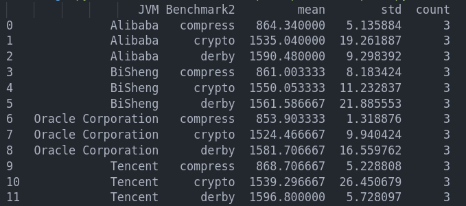
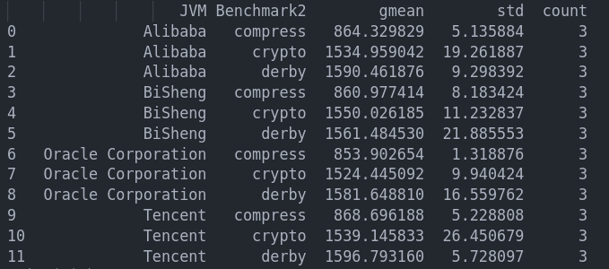
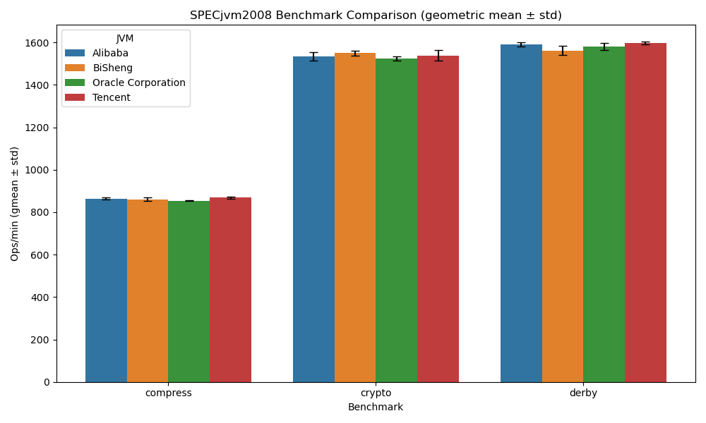
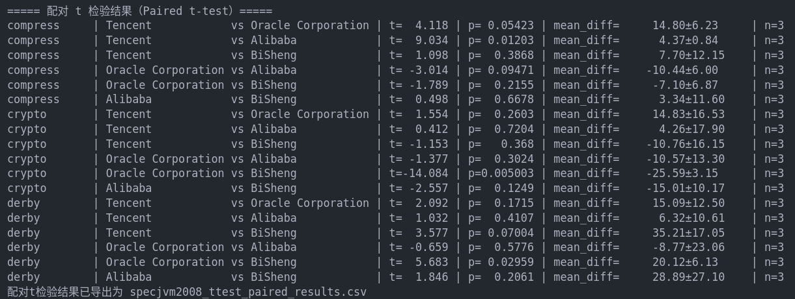

# Software Performance Evaluation

## 实验描述：

### :coffee: **JDK版本** 

本实验分别对4家厂商的jdk进行SPECjvm2008测试，对应版本分别是

| vendor     | jdk                        | version         |
|------------|----------------------------|-----------------|
| Oracal     | openjdk1.8.0_441           | 1.8.0_441       |
| Huawei     | bisheng-jdk1.8.0_452       | 1.8.0_452       |
| Tencent    | TencentKona-8.0.22-452     | 8.0.22-452      |
| Alibaba    | dragonwell-8.25.24         | 8.25.24         |

虽然实验要求安装并测试各厂商**最新稳定版本**的jdk环境，但考虑SPECjvm2008的软件**兼容性**问题，对各厂商统一使用**jdk8版本**进行测试。实际上，通过操作也可以发现SPECjvm2008确实不能jdk9+软件兼容(例如bisheng21 dragonwell24等)

### :rocket: **测试过程** 

本实验为自动化对比测试不同厂商 JDK 性能，编写了 `run_specjvm_all.sh` 脚本，批量运行 SPECjvm2008 基准测试。脚本支持 base/peak 两种模式，自动遍历 openjdk、bisheng、dragonwell、kona 四种 JDK，分别执行3轮测试并收集结果，目前脚本只对`derby` `crypto` `compress`三个任务进行测试。

脚本核心流程包括：自动检测 JDK 路径、设置统一 JVM 参数、循环多次运行基准测试、输出日志与结果。部分关键代码如下：

```bash
declare -A JDK_LIST
JDK_LIST["openjdk"]="$JDKS_DIR/jdk1.8.0_441/bin/java"
JDK_LIST["dragonwell"]="$JDKS_DIR/dragonwell-8.25.24/bin/java"
JDK_LIST["bisheng"]="$JDKS_DIR/bisheng-jdk1.8.0_452/bin/java"
JDK_LIST["kona"]="$JDKS_DIR/TencentKona-8.0.22-452/bin/java"

for jdk in "${!JDK_LIST[@]}"; do
    JAVA_CMD="${JDK_LIST[$jdk]}"
    for ((i=1; i<=ITERATIONS; i++)); do
        "$JAVA_CMD" $JVM_OPTS -jar "$SPECJVM_JAR" -ikv -wt $WARMUP_TIME -it $ITERATION_TIME $BENCH_ARGS
    done
done
```

通过该脚本，高效、批量地收集各 JDK 在相同硬件与参数下的 SPECjvm2008 性能数据，总共得到12(3 * 4)份跑分结果，以及一份log文件。

### :bar_chart: **数据处理和可视化** 

实验共采集 12 次运行记录，涉及 4 个 JVM 分发和 3 项子测试，每项运行产生独立 HTML 报告。我们使用`report.py`自动遍历所有 SPECjvm2008.00*/*.html 文件，定位 <td> 标签中 Benchmark 和 ops/m 数值，构建统一 DataFrame 结构。为保证分析一致性，将 crypto.aes、crypto.rsa、crypto.signverify 统一为 crypto 类别，共获得 36 条数据。

利用 Pandas 进行分组统计并可视化，**算数平均值结果**如下：

<p align="center">
  
</p>

<p align="center">
  
</p>

**几何平均值结果**如下：

<p align="center">
  
</p>

<p align="center">
  
</p>

图表说明：Dragonwell 在 compress 和 derby 上表现优异且波动较小，说明其在默认或调优参数在这类应用场景下具有稳定优势；Bisheng 在 derby 上波动较大，但均值接近其他厂商。

为了进一步量化两两JVM之间的性能差异，我们使用配对 t 检验分析每个子测试的结果。以下是配对 t 检验结果：

<p align="center">
  
</p>

### :page_with_curl: **结论** 

通过平均值分析发现，在 **CPU 密集型**的 compress 任务中，Tencent Kona 的性能略优，其算术平均约为 868.7 ops/m，明显高于 Openjdk 的 853.9 和 Dragonwell 的 864.3，配对 t‑test 显示与 Dragonwell 差异显著（p = 0.012 < 0.05），与 Openjdk 差异边缘显著（p ≈ 0.054）。**crypto 测试**中，BiSheng 平均约 1550 ops/m，与 Openjdk（1524）相比差异显著（p = 0.005 < 0.01），显示 BiSheng 在本地加密性能上的优化效果较为突出。**derby 任务**中，BiSheng 与 Openjdk 的差异也显著（mean 差约 20 ops/m，p = 0.030 < 0.05），表明其在内存密集或数据库模拟场景下表现稳定优异。其他 JVM 间差异大多不显著，说明它们在部分测试中性能接近。

整体来看，Openjdk 和 Dragonwell 的三个子测试分值均相近，波动幅度小，算术与几何平均值差异不足 1%，说明它们在默认配置和 PEAK 优化下表现均衡。Tencent 在 compress 类型场景下显示出优势，而 BiSheng 则在 crypto 和 derby 两种场景下显著领先。这样的表现结构反映了不同 JVM 分发针对特定任务负载的优化诉求，也契合 SPECjvm2008 所关注的 GC 性能、加密与对象操作性能多维评估。

**综上所述**，在符合实验设计的控制变量前提下，Tencent Kona 在 CPU 密集场景中性能最优，BiSheng 在内存与加密密集场景中表现出色，而 Openjdk 与 Dragonwell 保持稳定中等水平。


## Bonus Question

### Q2.1 Why is there run to run performance variation?

A: 同一套基准在多次独立运行中会出现性能差异，是因为执行路径中存在大量**非确定事件**：操作系统调度时刻不同(系统上其他进程可能会占用CPU和内存资源)、CPU高速缓存和TLB的即时填充不同、JVM编译器对热点方法的优化时机不同、垃圾回收暂停发生的具体点位和持续时间不同，以及硬件层动态频率调整对温度和功耗的即时相应不同。这些随机因素共同早就了 run to run variation。

### Q2.2 What contributes to run-to-run variation?

A: 可以将Q2.1中的波动因素归纳为以下三类：
- 软件栈 —— 内核上下文切换、IO中断频次、后台服务和守护线程抢占时间片、JIT编译和GC策略
- 硬件与微架构 —— 缓存预热程度、分支预测历史、内存控制器排队、SMT同核竞争、动态电源管理锁频与降频
- 外部环境 —— 机箱温度、散热曲线、虚拟化以及容器中的资源共享

### Q2.3 How do we validate the factors contributing to run-to-run variation?

A: 在**硬件**层面，可以采用单变量控制实验方法，逐一排除各种硬件配置对性能波动的影响(例如，使用单核CPU、禁用超线程、固定频率运行)；在**软件**层面，可以通过设置实时调度策略、禁用不必要的守护线程、使用特定的JVM参数（例如GC策略、GC停顿时长等）。通过多次单变量重复实验，理论上应该可以验证固定的软硬件配置环境下，run-to-run variation 应该收敛到一个较小的范围内，如果仍然存在较大波动，可以考虑SPECjvm2008中的子测试本身存在随机性，例如随机性函数调用造成的性能波动。

### Q2.4 What are the pros and cons of using arithmetic mean versus geometric mean in summarizing scores?

A: **算术平均**把每次得分视作简单累加并取平均，易于解释并更加直观；但出现子测试得分出现极端异常值时，算术平均会超高分项主导，并且整体分值对低分项变化极不敏感。**几何平均**把各得分看成乘性因子，能平衡量级差异大的数据，使每个子测试拥有相同的“比例权重”，且在乘法型性能度量（速度、吞吐率）上更符合“等比增长”的含义，而其缺点是若 存在 0 或负值需预处理，可读性偏低。

### Q2.5  Why does SPECjvm2008 use geometric mean? (In fact, it uses hierarchical geometric mean)

A: SPECjvm2008 之所以采用（层次）几何平均，是因为测试套件(例如crypto)中的子基准数量多、类型杂，得分可能从个位数到上千 ops/m 不等。直接用算术平均会让高分且相似的负载无限放大影响，而层次几何均值先在同子测试簇内做一次几何平均，再在簇间做第二次几何平均，既抵消了簇内冗余，又让所有簇在综合分里同权呈现，从而得到对 JVM 整体性能更鲁棒、更公平、更难被单一工作负载左右的单数字评价。
