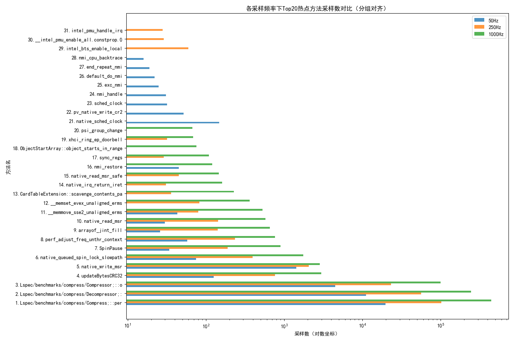

# Software Performance Analysis

## 实验描述

### :coffee: JDK版本

在 Ubuntu 22.04 x86-64 主机上，分别对4家厂商的jdk进行SPECjvm2008测试，对应版本分别是

| vendor     | jdk                        | version         |
|------------|----------------------------|-----------------|
| Oracal     | openjdk1.8.0_441           | 1.8.0_441       |

为了能够使用 jvm 启动参数中的 PreserveFramePointer 选项，获取函数调用栈，必须使用 jdk8 以上版本的 jvm，不能使用SPECjvm2008最兼容的jdk7版本。

### :rocket: 实验步骤

本次实验将所有操作集成到bash脚本 `run_compress_flamegraph.sh` 中，首先把 `perf-map-agent`、`FlameGraph` 脚本集以及 `export-to-sqlite.py` 脚本分别放在 `$PMA_HOME`、`$FG_HOME` 和 `$EXPORT_SQLITE` 位置，把路径、采样频率 (SAMPLES = 100 Hz)、采样时长 (DURATION = 180 s) 与目标基准 BENCH=compress 编辑为脚本顶部的变量，保证后续指令调度提供同一名称。

在SPECjvm2008软件的运行前，脚本调用参数 `-XX:+PreserveFramePointer` 和 `-XX:+DebugNonSafepoints` 让perf可以遍历基于栈指针的堆栈，后续输出函数调用栈，然后启动SPECjvm2008并在后台运行，运行指令如下：

```bash
$JAVA_BIN \
  -XX:+PreserveFramePointer \
  -XX:+UnlockDiagnosticVMOptions -XX:+DebugNonSafepoints \
  -jar "SPECjvm2008.jar" \
  -wt 60s -it 180s "$BENCH" &
```

在**符号映射**阶段，为了让 perf 能够解析 JIT 地址，获取具体的 Java 函数名称，脚本需要调用 `perf-map-agent` 中的 `/bin/create-java-perf-map.sh` 为该 `SPECjvm2008`的 PID 写出符号映射文件。通过jvm运行时的符号映射，后续解析出的火焰图和sqlite数据库中的结构化数据才能得到可读的 Java 函数名称，`perf-map-agent` 指令运行如下：

```bash
echo ">>> 生成 perf-map（Java ↔ JIT 代码地址映射）"
sudo -E JAVA_HOME=$JAVA_HOME "$PMA_HOME/bin/create-java-perf-map.sh" $APP_PID
```

在**采样**阶段，同一段测量窗口内，脚本对三档采样频率（50 / 250 / 1000 Hz）依次执行 `perf record -g -o perf_F${F}.data`，用于后续研究`sampling granularity`和`intrusion on application`之间的权衡做好铺垫；文件大小通过 du 回显，便于直观了解不同频率带来的数据量与开销差异，运行指令如下：

```bash
for F in 50 250 1000; do
  OUT=perf_F${F}
  sudo perf record -F $F -g -o $OUT_DIR/$OUT.data -p $APP_PID -- sleep 60
  echo "$(du -h $OUT_DIR/$OUT.data | cut -f1)  ← perf.data @${F}Hz"
  sudo perf script -i "$OUT_DIR/$OUT.data" -s "$EXPORT_SQLITE" "$OUT_DIR/$OUT.sqlite" all calls
done
```

在后期**数据处理**阶段，包括以下几个部分
- 火焰图生成：先以 perf script 把二进制 perf.data 还原为文本堆栈，再用 `stackcollapse-perf.pl` 折叠成 FlameGraph 输入格式，最后交给 `flamegraph.pl` 渲染 SVG 火焰图。
- perf report可读化文本：使用 `perf report --stdio` 把原始二进制数据 `perf.data` 解析为文本方便对照阅读。过程结束后，脚本把所有输出归档到 `perf_compress_*` 目录。
- sqlite结构化数据存储：通过`perf script`调用linux内核脚本`export-to-sqlite.py`，将 perf.data 解析为结构化的 sqlite 数据库，包含 samples、symbols、call_paths 等表格。
- sqlite结构化数据分析：使用 `perf_sqlite_analysis.py` 脚本对 sqlite 数据库进行分析，对不同采样频率得到的结构化数据生成采样数量、热点方法、函数耗时等统计数据，并输出为图表。

### :bar_chart: 实验结果

:page_with_curl: **perf report报告**：通过分析perf report 输出结果主要调用路径，可以看到在 compress 负载下，`BenchmarkThread` 占据了 98.79% 的 CPU 时间，说明该线程是性能瓶颈的主要来源。进一步分析调用栈，可以发现 `Lspec/harness/BenchmarkThread;::runLoop` 方法占据了大部分时间，而 `Lspec/benchmarks/compress/Main;::harnessMain` 方法则是压缩操作的入口点。显然`Lspec/benchmarks/compress/Compressor;::output` 方法和 `Lspec/benchmarks/compress/Decompressor;::decompress` 方法是主要调用路径的性能瓶颈，加压缩和压缩操作是性能瓶颈的关键所在，该结论从之后的火焰图分析中也得到了印证。

```log
# Children      Self  Command          Shared Object      Symbol
    98.79%     0.00%  BenchmarkThread  libc.so.6          [.] start_thread
            |
            ---start_thread
               java_start(Thread*)
               JavaThread::thread_main_inner()
               thread_entry(JavaThread*, Thread*)
               JavaCalls::call_virtual(JavaValue*, Handle, KlassHandle, Symbol*, Symbol*, Thread*)
               JavaCalls::call_virtual(JavaValue*, KlassHandle, Symbol*, Symbol*, JavaCallArguments*, Thread*)
               JavaCalls::call_helper(JavaValue*, methodHandle*, JavaCallArguments*, Thread*)
               call_stub
               Interpreter
               |          
                --98.79%--Interpreter
                          |          
                           --98.79%--Lspec/harness/BenchmarkThread;::runLoop
                                     |          
                                      --98.79%--Lspec/benchmarks/compress/Main;::harnessMain
                                                |          
                                                |--68.06%--0x7016a959c574
                                                |          |          
                                                |          |--67.04%--Lspec/benchmarks/compress/Compress;::performAction
                                                |          |          |          
                                                |          |           --11.54%--Lspec/benchmarks/compress/Compressor;::output
                                                |          |          
                                                |           --1.01%--Lspec/benchmarks/compress/Compressor;::output
                                                |          
                                                 --30.32%--0x7016a959c5f0
                                                           Lspec/benchmarks/compress/Compress;::performAction
                                                           |          
                                                            --30.31%--Lspec/benchmarks/compress/Decompressor;::decompress
```

:mag_right: **perf stat 报告**：不同于perf record 聚焦于函数、调用路径，用于精确定位热点函数和关键代码路径的功能，perf stat提供整体的性能统计，更加关注应用的整体资源占用、执行效率和系统瓶颈，更适合把控全局的性能状况。
以下通过perf stat 工具对 compress 负载进行性能统计，使用采样频率为 **250Hz** 时的性能计数器统计结果。可以看到，整个测试过程中 CPU 利用率达到 14.9%，总共执行了约 14.3 万亿条指令，平均每个周期执行 1.47 条指令，表明 CPU 在处理压缩任务时的效率较高。而L1 数据缓存缺失率 8.8%，LLC缺失率 8%，整体缓存未命中率达 22.9%，提示内存访问局部性还有优化空间，缓存性能已成为影响整体效率的关键因素之一。

```log
# started on Tue Jul  8 15:24:35 2025


 Performance counter stats for process id '129796':

      2,682,303.19 msec task-clock                       #   14.901 CPUs utilized             
           478,601      context-switches                 #  178.429 /sec                      
            12,331      cpu-migrations                   #    4.597 /sec                      
            24,926      page-faults                      #    9.293 /sec                      
 9,726,176,937,455      cycles                           #    3.626 GHz                         (73.34%)
14,339,985,603,316      instructions                     #    1.47  insn per cycle              (82.50%)
 2,136,008,427,176      branches                         #  796.334 M/sec                       (82.49%)
    74,082,030,811      branch-misses                    #    3.47% of all branches             (82.49%)
    13,329,878,978      cache-references                 #    4.970 M/sec                       (82.49%)
     3,051,890,449      cache-misses                     #   22.90% of all cache refs           (82.50%)
 3,805,536,623,745      L1-dcache-loads                  #    1.419 G/sec                       (82.50%)
   334,148,188,404      L1-dcache-load-misses            #    8.78% of all L1-dcache accesses   (82.50%)
     2,179,933,838      LLC-loads                        #  812.710 K/sec                       (82.50%)
       174,500,369      LLC-load-misses                  #    8.00% of all LL-cache accesses    (75.89%)

     180.002671861 seconds time elapsed
```

:fire: **火焰图**：以下火焰图采用 perf 工具以 **250Hz** 采样频率对 **compress** 负载运行过程进行调用栈采集，火焰图的横轴代表方法被采样到的次数，纵向则以层级堆叠的方式展示各调用路径的栈结构，上层方法为调用者，下层方法为被调用者。“火苗”宽度反映该栈路径累计消耗的时间，越宽则说明该路径越“热”，是性能优化的重点对象。通过对 250Hz flamegraph 的分析，可以观察到 compress 工作负载的主要 CPU 时间集中在核心的数据压缩逻辑的相关方法中，例如`Compressor`类的`compress`方法和`Decompressor`的`decompress`方法。对于用户程序，最宽的火焰块位于`Compress`类的`performAction`方法，除了反应`compress`方法和`decompress`方法在`performAction`中的高频调用，压缩和解压缩之前的**输入输出缓冲区创建**同样在整个函数调用过程中占用了大量时间，其次，因为一些 JVM 底层native方法被上一层Java包装方法反复调用，导致在火焰图中形成显著的“高原地带”。

```java
public static OutputBuffer performAction(byte[] src, int srcLength,
        int action, byte[] dst) {
    
    InputBuffer in = new InputBuffer(srcLength, src);
    OutputBuffer out = new OutputBuffer(dst);
    
    if (action == COMPRESS) {
        new Compressor(in, out).compress();
    } else {
        new Decompressor(in, out).decompress();
    }
    return out;
}
```


## Bonus Question

### Q3.1 Share a case study of using Perf tools to analyze or optimize the performance of a Java application.

A: 在本实验中，主要使用到的perf工具链包括 `perf record`、`perf script`、`perf report` 和 `perf stat`，对SPECjvm2008的 `compress` 子基准进行系统性的性能分析，以下实验中运用到的perf指令也是我对perf工具学习和应用的总结

首先，通过 `perf stat` 对 `compress` 任务全程进行宏观性能计数。正如结果显示，应用在多核 CPU 上实现了较高的资源利用率，但 L1 和 LLC 缓存缺失率较高，提示内存访问局部性仍有优化空间。`perf stat`具体指令如下
```bash
perf stat -e task-clock,context-switches,cpu-migrations,page-faults,cycles,instructions,branches,branch-misses \
    -e cache-references,cache-misses,L1-dcache-loads,L1-dcache-load-misses,LLC-loads,LLC-load-misses \
    -p $APP_PID -o "$OUT_DIR/perf_stat.txt" \
    -- sleep $DURATION
```

具体参数含义是

- `-e`: 指定要监控的性能事件列表
- `-p`: 指定要监控的进程 ID
- `-o`: 将统计结果输出到指定文件
- `-- sleep`: 在指定的持续时间内监控性能事件

随后，采用 `perf record` 以 250Hz 的频率对 `compress` 进程进行采样，并结合 `perf-map-agent` 实现 Java JIT 方法名的符号解析，生成可解释的 `perf.data` 采样文件。使用 `FlameGraph` 工具渲染后，可以直观看到性能最为集中的火焰区域区域——主要对应于 `Lspec/benchmarks/compress/Compress;::performAction` 等调用压缩算法核心函数。火焰图的宽度直接反映了每个函数消耗的 CPU 时间比例，是定位代码级热点和瓶颈的有力支撑。具体的采样指令如下：

```bash
sudo perf record -F $F -g -o $OUT_DIR/$OUT.data -p $APP_PID -- sleep 60
```

具体参数含义是
- `-F`: 设置采样频率
- `-g`: 启用调用图采样，记录函数调用关系
- `-o`: 指定输出文件路径
- `-p`: 指定要监控的进程 ID
- `-- sleep`: 在指定的持续时间内进行采样

最后，是关于 `perf script` 的运用，该指令除了将`perf record`输出的二进制性能数据转化为人类可读的文本，还可以调用第三方脚本对`perf.data`进行进一步处理，`sqlite`结构化存储数据便是这样实现，通过 `perf script` 调用 linux 内核脚本`export-to-sqlite.py`脚本，将 `perf.data` 中的性能数据解析为结构化数据存储在 `*.sqlite`数据库文件中，后续通过自编的`perf_sqlite_analysis.py`对性能数据库进行检索和可视化。需要注意的是，`export-to-sqlite.py`脚本开头的注释中明确提示需要通过该指令`sudo apt-get install python3-pyside2.qtsql libqt5sql5-psql`来安装对`PySide.QtSql`的依赖，而非通过`pip`或者`conda`安装。


### Q3.2 Discuss the trade-offs between sampling granularity and the induced performance overhead. Explain how adjusting sampling frequency can balance diagnostic detail with minimal intrusion on application behavior.

A: 针对本问题，我通过 `run_compress_flamegraph.sh` 脚本和 `perf_sqlite_analysis.py` 脚本，系统性地对不同采样频率（50Hz、250Hz、1000Hz）下的 SPECjvm2008 `compress` 子基准进行了性能采样与分析，研究采样粒度对性能数据详尽度和系统开销的影响，得出以下结论

1. **采样频率越高，采集到的样本总数越多，性能热点的分布越细致。**

    下图直观展示了采样频率提升带来的样本数量激增：50Hz 下仅采集到约5万条样本，1000Hz 下则超过80万条。这意味着高频采样能更全面地捕捉到短暂或低频出现的热点函数，有助于发现微小但关键的性能瓶颈。

<p align="center">

</p>

2. **采样粒度会对热点方法识别产生影响**

    以下两张图分别展示了不同采样频率下热点方法的采样数和总cycles（函数耗时）分布。可以看到，随着采样频率提升，热点方法的分布更加细化，部分方法**在高频采样下**才被识别为热点。采用分组对齐的可视化方式，确保同一方法在不同频率下的表现可以直接横向对比。注意，此处x轴采用对数坐标，解决了不同方法采样数/耗时数量级差异过大的可视化问题。

    <p align="center">
    
    </p>

    <p align="center">
    
    </p>

3. **采样频率越高，性能开销越大**

    从 `perf_compress_*/spec.log` 测试日志可以看到，采样频率越高，生成的 `perf.data` 文件体积越大，后续的数据处理和分析耗时也随之增加。过高的采样频率还可能对被测应用产生“观测者效应”，即采样本身对应用性能造成干扰，影响测试结果的真实性。

    ```log
    [ perf record: Woken up 539431 times to write data ]
    [ perf record: Captured and wrote 6.175 MB /home/ben/workspace/perflab/perf_compress_20250708_152348/perf_F50.data (35629 samples) ]
    6.3M  ← perf.data @50Hz
    2025-07-08 15:25:36.786443 Creating database ...
    2025-07-08 15:25:36.799572 Writing records...
    2025-07-08 15:25:39.119825 Adding indexes
    2025-07-08 15:25:39.124341 Dropping unused tables
    2025-07-08 15:25:39.137175 Done
    [ perf record: Woken up 113 times to write data ]
    [ perf record: Captured and wrote 30.366 MB /home/ben/workspace/perflab/perf_compress_20250708_152348/perf_F250.data (184050 samples) ]
    31M  ← perf.data @250Hz
    2025-07-08 15:26:41.196610 Creating database ...
    2025-07-08 15:26:41.211619 Writing records...
    2025-07-08 15:26:49.474366 Adding indexes
    2025-07-08 15:26:49.479034 Dropping unused tables
    2025-07-08 15:26:49.494255 Done
    [ perf record: Woken up 497 times to write data ]
    [ perf record: Captured and wrote 126.805 MB /home/ben/workspace/perflab/perf_compress_20250708_152348/perf_F1000.data (771865 samples) ]
    127M  ← perf.data @1000Hz
    2025-07-08 15:27:51.357682 Creating database ...
    Iteration 1 (180s) ends:   Tue Jul 08 15:28:07 CST 2025
    Iteration 1 (180s) result: 719.85 ops/m
    ```

以下是本实验中三种不同采样频率下的火焰图，分别对应 50Hz、250Hz 和 1000Hz 的采样频率。可以看到，随着采样频率的提升，火焰图中的热点函数分布更加细致，但同时也伴随着更大的数据量和处理开销。

<p align="center">
  
</p>

<p align="center">
  
</p>

<p align="center">
  
</p>

综上所述，低频采样（本实验中的50HZ）对应用影响小，适合长时间运行、对性能开销敏感的场景，但可能遗漏短暂热点；高频采样（本实验中的1000Hz）能捕获更多细节，适合短时间、精细化分析，但需关注系统负载和数据处理能力。在实际应用中，我们应该折中选择，本实验中的 250Hz 采样频率已能较好地还原主要热点分布，且系统开销可控。

### Q3.3 Explore the benefits of combing different profiling techniques to gain a comprehensive understanding of application performance.


